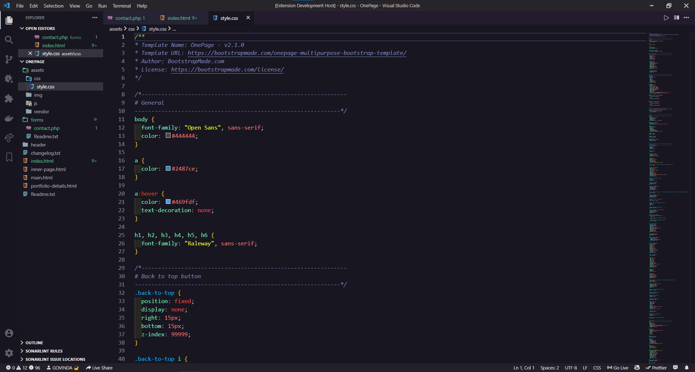
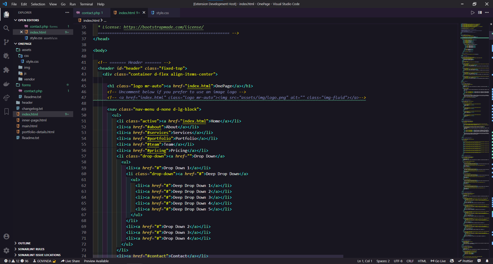
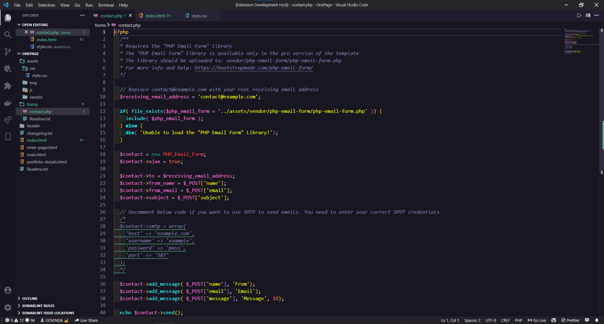

 <h1 align="center"> Codeorzo Vscode Theme</h1>

 

## Installation

1. Open the extensions sidebar on Visual Studio Code
1. Search for codeorzo Theme
1. Click Install
1. Click Reload to reload your editor
1. Go to setting and choose color theme (codeorzo)
1. 🌟🌟🌟🌟🌟 Rate five-stars 😃

## Issues & Suggestions

For any issues or suggestions, please use [GitHub issues](https://github.com/GOVINDARAJLE/Codeorzo-vscode_theme/issues/).
